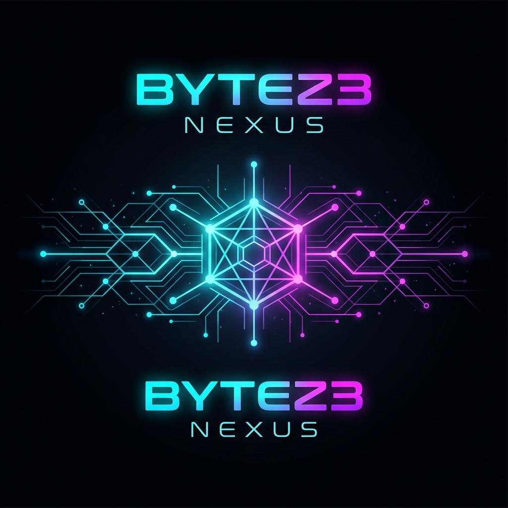

<p align="center">
  
</p>

<h1 align="center">Bytez3 Nexus</h1>

<p align="center">
  <strong>Open-source AI agent system — run agentic coding assistants with any local LLM</strong>
</p>

<p align="center">
  <a href="https://ollama.com"></a>
  <a href="https://modelcontextprotocol.io"></a>
  <a href="https://nodejs.org"></a>
  <a href="https://opensource.org/licenses/MIT"></a>
  <a href="https://github.com/SteOnChain/bytez3-nexus/stargazers"></a>
</p>

<p align="center">
  <a href="#quick-start">Quick Start</a> •
  <a href="#features">Features</a> •
  <a href="#architecture">Architecture</a> •
  <a href="#mcp-servers">MCP Servers</a> •
  <a href="#models">Models</a> •
  <a href="#roadmap">Roadmap</a>
</p>

---

## What is Bytez3 Nexus?

**Bytez3 Nexus** is an open-source AI agent system that lets you run powerful, agentic coding assistants using **any local or cloud-hosted LLM** — no proprietary API keys required. Built on a restored and extended version of the Claude Code CLI architecture, Nexus adds a transparent translation proxy that routes all agent requests through Ollama's OpenAI-compatible endpoint.

Unlike cloud-locked alternatives, Nexus gives you:

- **Full data sovereignty** — your code never leaves your machine
- **Model freedom** — swap between Llama, Qwen, DeepSeek, Mistral, or any Ollama model
- **Agent-grade tooling** — 30+ built-in tools, MCP server support, multi-agent coordination
- **Zero vendor lock-in** — open source, self-hosted, yours to extend

---

## Features

### 🤖 AI Agent System
- **Multi-agent coordination** — orchestrate multiple AI agents working in parallel
- **30+ built-in tools** — file editing, bash execution, grep, git, web search, and more
- **Tool calling** — full function calling with structured input/output schemas
- **Streaming** — real-time token streaming for responsive interactions

### 🔌 MCP Server Support
- **Model Context Protocol** — connect to any MCP-compatible tool server
- **Extensible** — add GitHub, GitKraken, database, and custom tool servers
- **Dynamic tool discovery** — agents automatically discover and use MCP tools
- **Permission system** — granular control over what agents can access

### 🏠 Local-First Architecture
- **Ollama integration** — native support for local and cloud-hosted Ollama instances
- **Any model** — use whatever you've pulled: Llama, Qwen, DeepSeek, Mistral, CodeLlama
- **Privacy by default** — no telemetry, no data collection, no cloud dependency
- **Offline capable** — works entirely without internet (with local models)

### ☁️ Cloud Provider Support
- **Ollama Cloud** — connect to remote Ollama deployments with API key auth
- **Extensible provider system** — architecture supports adding new LLM providers
- **Hybrid mode** — mix local and cloud models as needed

---

## Quick Start

### Prerequisites

1. **[Ollama](https://ollama.com)** installed and running (`ollama serve`)
2. **A model pulled** — e.g. `ollama pull qwen2.5-coder:7b`
3. **Node.js 18+**

### Installation

```bash
# Clone
git clone https://github.com/SteOnChain/bytez3-nexus.git
cd bytez3-nexus

# Install dependencies
npm install
```

### Run Tests

```bash
# Translation tests (no Ollama needed)
npm test

# Full test suite with live Ollama connection
npm run test:live

# Test with specific model
OLLAMA_MODEL=qwen2.5:7b npm run test:ollama
```

### Usage

```bash
# Local Ollama — run with any local model
CLAUDE_CODE_USE_OLLAMA=1 ANTHROPIC_MODEL=qwen2.5-coder:7b nexus

# Ollama Cloud — connect to remote instances
CLAUDE_CODE_USE_OLLAMA=1 \
  OLLAMA_BASE_URL=https://your-cloud.ollama.ai \
  OLLAMA_API_KEY=sk-your-key \
  ANTHROPIC_MODEL=llama3.2 \
  nexus
```

---

## Architecture

Bytez3 Nexus uses a **fetch-level interception** architecture. When the Ollama provider is active, all API calls from the agent system are transparently translated:

```
┌──────────────────────────────────────────────────────────┐
│                    BYTEZ3 NEXUS                          │
│                                                          │
│  ┌──────────┐    ┌──────────┐    ┌───────────────────┐  │
│  │  Agent    │───▶│   SDK    │───▶│  Fetch Override   │  │
│  │  System   │    │  Client  │    │  (Translation)    │  │
│  └──────────┘    └──────────┘    └─────────┬─────────┘  │
│       │                                     │            │
│  ┌────▼─────┐                  ┌────────────▼─────────┐ │
│  │   MCP    │                  │  Request Translator   │ │
│  │ Servers  │                  │ Anthropic → OpenAI    │ │
│  └──────────┘                  └────────────┬─────────┘ │
│                                             │            │
│                                ┌────────────▼─────────┐ │
│                                │       Ollama          │ │
│                                │ /v1/chat/completions  │ │
│                                └────────────┬─────────┘ │
│                                             │            │
│                                ┌────────────▼─────────┐ │
│                                │ Response Translator   │ │
│                                │ OpenAI SSE → Agent    │ │
│                                └──────────────────────┘ │
└──────────────────────────────────────────────────────────┘
```

### Translation Layer

| Agent Format (Anthropic) | LLM Format (OpenAI/Ollama) |
|---|---|
| `system: [{type: 'text', text}]` | `{role: 'system', content}` |
| `{type: 'tool_use', id, name, input}` | `tool_calls: [{function: {name, arguments}}]` |
| `{type: 'tool_result', tool_use_id}` | `{role: 'tool', tool_call_id}` |
| `content_block_delta` (SSE) | `choices[].delta` (SSE) |
| `stop_reason: 'tool_use'` | `finish_reason: 'tool_calls'` |

---

## MCP Servers

Bytez3 Nexus supports the **Model Context Protocol (MCP)** — an open standard for connecting AI agents with external tools and data sources. Any MCP-compatible server works out of the box:

| Server | Tools Provided |
|---|---|
| **GitHub** | Issues, PRs, code search, repo management |
| **GitKraken** | Git operations, branch management, worktrees |
| **Prisma** | Database migrations, schema management, Studio |
| **Google Maps** | Geocoding, routing, places, directions |
| **Custom servers** | Build your own with the MCP SDK |

MCP tools are automatically discovered, translated through the Ollama proxy, and available to the agent system — no configuration needed beyond connecting the server.

---

## Models

### Recommended Models

| Model | Size | Best For | Tool Calling |
|---|---|---|---|
| `qwen2.5-coder:7b` | 4.7 GB | Code generation, refactoring | ✅ Excellent |
| `qwen2.5-coder:32b` | 18 GB | Complex coding tasks | ✅ Excellent |
| `llama3.2` | 2.0 GB | General purpose, fast | ✅ Good |
| `deepseek-r1:8b` | 4.9 GB | Reasoning, debugging | ⚠️ Basic |
| `mistral:7b` | 4.1 GB | Balanced performance | ✅ Good |
| `codellama:13b` | 7.4 GB | Code-focused, large context | ✅ Good |
| `qwen2.5:72b` | 41 GB | Best quality (needs GPU) | ✅ Excellent |

### Model Selection Tips

- **For tool calling** (MCP, file editing, bash): Use `qwen2.5-coder` — best tool-calling accuracy
- **For speed**: Use `llama3.2` — smallest, fastest responses
- **For reasoning**: Use `deepseek-r1:8b` — chain-of-thought reasoning
- **For maximum quality**: Use `qwen2.5:72b` — if you have the VRAM

---

## Environment Variables

| Variable | Default | Description |
|---|---|---|
| `CLAUDE_CODE_USE_OLLAMA` | — | Set to `1` to enable Ollama provider |
| `OLLAMA_BASE_URL` | `http://localhost:11434` | Ollama server URL |
| `OLLAMA_API_KEY` | — | API key for Ollama Cloud authentication |
| `ANTHROPIC_MODEL` | — | Model name (e.g., `qwen2.5-coder:7b`) |

---

## Project Structure

```
bytez3-nexus/
├── restored-src/src/                     # Agent system source (TypeScript)
│   ├── main.tsx                          # CLI entry point
│   ├── services/api/
│   │   ├── client.ts                     # API client factory (Ollama injection)
│   │   ├── claude.ts                     # Message handling & streaming
│   │   └── ollama/                       # Ollama translation proxy
│   │       ├── ollamaClient.ts           # Fetch override factory
│   │       ├── requestTranslator.ts      # Anthropic → OpenAI translation
│   │       └── responseTranslator.ts     # OpenAI → Anthropic SSE translation
│   ├── services/mcp/                     # MCP server integration
│   ├── tools/                            # 30+ built-in tools
│   ├── coordinator/                      # Multi-agent coordination
│   ├── assistant/                        # Assistant mode
│   ├── plugins/                          # Plugin system
│   ├── skills/                           # Skills system
│   └── voice/                            # Voice interaction
├── test-ollama.mjs                       # Test suite (49 assertions)
├── assets/                               # Branding assets
└── package.json                          # Project metadata
```

---

## Test Results

```
═══ Bytez3 Nexus — Test Suite ═══

▸ Request Translation (Anthropic → OpenAI)        16/16 ✅
▸ Response Stream Translation (OpenAI → Anthropic) 10/10 ✅
▸ Tool Call Response Translation                    8/8  ✅
▸ Non-Streaming Response Translation               10/10 ✅
▸ Live Ollama Connection                            5/5  ✅

═══ Results ═══
  49 passed  0 failed  ✓ All systems operational
```

---

## Roadmap

- [x] **Ollama integration** — local + cloud model support
- [x] **Tool calling** — full function calling translation
- [x] **Streaming** — real-time SSE translation
- [x] **MCP support** — Model Context Protocol compatibility
- [ ] **Multi-model routing** — route different tasks to different models
- [ ] **Agent memory** — persistent context across sessions
- [ ] **Custom agent definitions** — YAML-based agent configuration
- [ ] **Web UI** — browser-based agent dashboard
- [ ] **Plugin marketplace** — community-built extensions
- [ ] **Voice mode** — voice-driven agent interaction
- [ ] **Team agents** — collaborative multi-agent workflows

---

## Contributing

Contributions are welcome! Whether it's bug fixes, new features, documentation, or ideas — open an issue or submit a PR.

```bash
# Fork the repo
git clone https://github.com/YOUR_USERNAME/bytez3-nexus.git
cd bytez3-nexus
npm install

# Run tests
npm test

# Make your changes and submit a PR
```

---

## License

MIT © [Bytez3](https://github.com/SteOnChain)

---

<p align="center">
  Built with ⚡ by <a href="https://github.com/SteOnChain">Bytez3</a>
</p>
